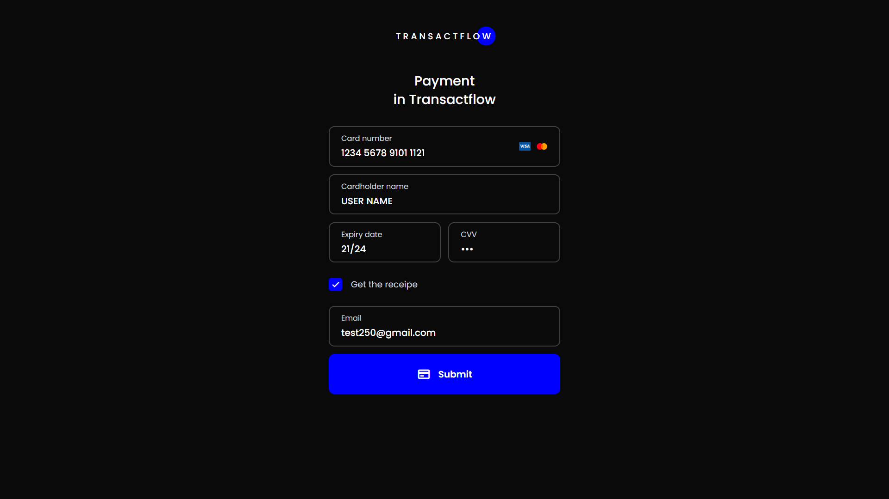

## Payment Form

This project is a basic payment form interface created using HTML, CSS, and JavaScript. It provides a visual representation of a payment page, allowing users to input their card details and email for receipt. The project focuses on the frontend design and user interaction.

### Key Features
* User-friendly input fields for card number, cardholder name, expiry date, CVV, and email.
* Visually appealing design using CSS.
* Basic form validation (optional).
* Checkbox for enabling receipt generation.